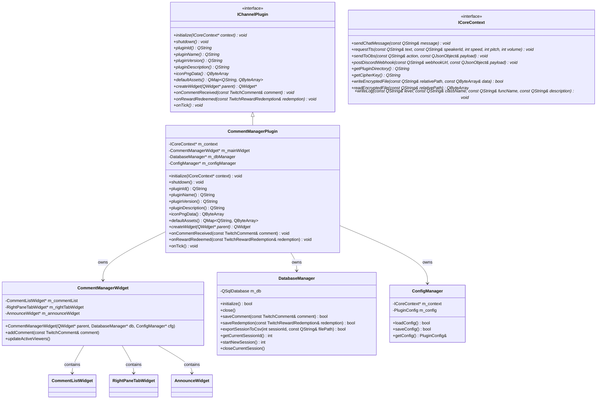

# CommentManagerPlugin 基本設計書

本ドキュメントは、TwitchChannelManagementTool（以下、ホストアプリ）のプラグインとして動作する「CommentManagerPlugin」の基本設計について定義します。

---

## 1. システム構造設計

本プラグインは、ホストアプリが提供する `IChannelPlugin` インターフェースを実装し、DLL (動的リンクライブラリ) として提供されます。プラグインの内部コンポーネント構成とホストアプリとの関係は以下の通りです。

### 1.1. コンポーネント構成図



---

## 2. データ・ファイル設計

### 2.1. 設定ファイル（`config.bin`）設計
本プラグインの設定は、ホストアプリの `ICoreContext` 経由で暗号化（難読化）して保存します。

- **保存API**: `bool ICoreContext::writeEncryptedFile(const QString& relativePath, const QByteArray& data)`
- **読込API**: `QByteArray ICoreContext::readEncryptedFile(const QString& relativePath)`
- **保存場所**: `plugins/CommentManagerPlugin/config.bin` （相対パス指定: `"config.bin"`）
- **データフォーマット**: JSON文字列（UTF-8）を `QByteArray` にシリアライズして暗号化。

#### JSONデータ構造定義
```json
{
  "overlayTheme": "default",
  "excludedUsers": ["bot1", "bot2", "spammer"],
  "excludedTtsUsers": ["noisy_user"],
  "ttsConfig": {
    "speakerId": 1,
    "speed": 1.0,
    "pitch": 1.0,
    "volume": 0.8
  }
}
```

### 2.2. 動作デバッグログ設計
プラグインのシステムログ、エラー、およびデバッグ情報は、ホストアプリが管理する共通ログに書き出します。

- **ログAPI**: `void ICoreContext::writeLog(const QString& level, const QString& className, const QString& funcName, const QString& description)`
- **引数の使い分け**:
  - `level`: ログレベルを表す文字列。`"Info"`, `"Warning"`, `"Error"` など。
  - `className`: クラス名（例: `"CommentManagerPlugin"`）。
  - `funcName`: メソッド・関数名（例: `"initialize"`）。
  - `description`: ログメッセージ本文。
- **ログレベル使い分け**:
  - `"Info"`: 初期化・終了、セッション開始、CSVエクスポート完了などの正常系ライフサイクルイベント。
  - `"Warning"`: 接続遅延、設定ファイルパースエラー（デフォルト復帰）、DB一時エラー。
  - `"Error"`: DBオープン失敗、書き込み失敗、CSV出力失敗など、プラグイン機能に支障が出るレベルの例外。

### 2.3. データベース（`users.db`）設計
コメント履歴の格納、リスナー分類、および解析タブの集計元として、SQLite 3 データベース（`users.db`）を使用します。

- **保存場所**: `plugins/CommentManagerPlugin/data/users.db`

#### テーブル定義

##### 1. `sessions` テーブル（配信セッション管理）
| カラム名 | 型 | 制約 | 説明 |
| :--- | :--- | :--- | :--- |
| `session_id` | INTEGER | PRIMARY KEY AUTOINCREMENT | セッション識別子 |
| `started_at` | TEXT | NOT NULL | 開始日時（ISO8601形式: `YYYY-MM-DD HH:mm:ss`） |
| `ended_at` | TEXT | | 終了日時（ISO8601形式。配信中は NULL） |

##### 2. `users` テーブル（リスナーマスタ）
| カラム名 | 型 | 制約 | 説明 |
| :--- | :--- | :--- | :--- |
| `user_id` | TEXT | PRIMARY KEY | Twitch 内部ユーザーID（数値） |
| `username` | TEXT | NOT NULL | ログインID（英小文字） |
| `display_name` | TEXT | | 表示名（ローカライズ名） |
| `comment_count` | INTEGER | DEFAULT 0 | 累計コメント数 |
| `last_active_at` | TEXT | | 最終アクティブ日時（ISO8601） |
| `category` | TEXT | | 基本属性（`streamer`, `moderator`, `vip`, `artist`, `bot`, `regular`） |

##### 3. `comments` テーブル（コメント履歴）
| カラム名 | 型 | 制約 | 説明 |
| :--- | :--- | :--- | :--- |
| `comment_id` | INTEGER | PRIMARY KEY AUTOINCREMENT | コメントID |
| `session_id` | INTEGER | REFERENCES `sessions`(`session_id`) | 配信セッションID |
| `user_id` | TEXT | REFERENCES `users`(`user_id`) | 発言者ID |
| `badge_info` | TEXT | | バッジ情報のシリアライズ文字列（カンマ区切り） |
| `message` | TEXT | NOT NULL | コメント本文 |
| `received_at` | TEXT | NOT NULL | 受信日時（ISO8601） |

##### 4. `points_redemptions` テーブル（チャンネルポイント引き換え履歴）
| カラム名 | 型 | 制約 | 説明 |
| :--- | :--- | :--- | :--- |
| `redemption_id` | INTEGER | PRIMARY KEY AUTOINCREMENT | 引き換えID |
| `user_id` | TEXT | REFERENCES `users`(`user_id`) | 利用者ID |
| `reward_id` | TEXT | NOT NULL | 報酬ID |
| `reward_title` | TEXT | NOT NULL | 報酬名 |
| `input_text` | TEXT | | 入力テキスト |
| `redeemed_at` | TEXT | NOT NULL | 引き換え日時（ISO8601） |

#### インデックス設計
検索・集計クエリのパフォーマンス向上のため、以下のインデックスを作成します。
- `CREATE INDEX idx_comments_session ON comments(session_id);` (セッションごとのコメント抽出用)
- `CREATE INDEX idx_comments_user ON comments(user_id);` (特定ユーザーの発言集計用)
- `CREATE INDEX idx_users_username ON users(username);` (ユーザー名によるマスタ引き当て用)

### 2.4. CSVエクスポート仕様 (終了時)
プラグイン終了処理（`shutdown()`）時、現在のセッションにおけるコメントデータを抽出し、CSVファイルとして一括保存します。

- **保存ファイル名**: `plugins/CommentManagerPlugin/logs/session_<yyyyMMdd_HHmmss>.csv`
  - ファイル名のタイムスタンプはセッション開始日時を使用します。
- **文字エンコーディング**: UTF-8 (BOM付き) - Excelでの文字化け防止のため。
- **データ列**:
  1. `Timestamp` (受信日時: `yyyy-MM-dd HH:mm:ss`)
  2. `Username` (Twitchログイン名)
  3. `DisplayName` (表示名)
  4. `Badges` (バッジリスト: 例 `"moderator,subscriber"`)
  5. `Message` (コメント内容。ダブルクォーテーションで囲み、改行はスペースに置換)

---

## 3. 画面レイアウト（GUI）設計

メイン画面は左右分割の `QSplitter` を基調とし、下部全体にアナウンス配信用UIを配置する **「2.5ペインレイアウト」** とします。

```
+---------------------------------------------------------------------------------------+
|  左ペイン: コメントリスト                               |  右ペイン: タブ切替式情報表示部                      |
|                                                       |  +---------------------------------+  |
|  [バッジ] ユーザー名: コメント内容                        |  | 視聴者  |  解析  |  設定               |  |
|  [バッジ] ユーザー名: コメント内容                        |  +---------------------------------+  |
|  [バッジ] ユーザー名: コメント内容                        |  |                                 |  |
|                                                       |  |  (選択されたタブのコンテンツ)         |  |
|                                                       |  |                                 |  |
|                                                       |  |                                 |  |
|                                                       |  |                                 |  |
|                                                       |  |                                 |  |
|                                                       |  +---------------------------------+  |
+---------------------------------------------------------------------------------------+
|  下部ペイン: [色選択 V]  [ アナウンスメッセージを入力...                            ]  [送信]  |
+---------------------------------------------------------------------------------------+
```

### 3.1. 左ペイン: コメントリスト表示部 (テーブル形式)
- テーブル表示形式として **`QTreeView`** を使用し、コメントを順次追加します。
- カラム構成は **`Time`** , **`Username`** , **`Message`** の3列で、ヘッダー行を常時表示します。
- 各セルには `QStyledItemDelegate` を継承した **`HtmlDelegate`** を適用し、HTMLリッチテキストのタグを用いてユーザー名（パープル）やコメント本文（ホワイト）、絵文字バッジ（👑, 🛡️, 💎, ⭐）を色分け表示します。
- **除外ユーザー処理**: `ConfigManager` の除外ユーザー一覧に登録されているユーザーからのコメントは、テーブル追加時に破棄（非表示）されます。

### 3.2. 右ペイン: タブ切替式情報表示部

#### 3.2.1. 「視聴者」タブ
配信セッションで活動したリスナーをカテゴリ別アコーディオンで表示し、個別操作をサポートします。

```
+--------------------------------------------------------------------+
| [更新]  最終更新: 15:30:12                                          |
+--------------------------------------------------------------------+
| > すべて (150)                                                     |
| V モデレーター (3)                                                  |
|   - moderator_a                                                    |
|   - moderator_b                                                    |
|   - moderator_c                                                    |
| > VIP (5)                                                          |
| > チャットボット (2)                                                |
| > 一般 (140)                                                       |
+--------------------------------------------------------------------+
```
- **アコーディオンコンポーネント**: `QTreeView` をツリー形式で利用し、第1階層をカテゴリ（すべて、ストリーマー、モデレーター、VIP、アーティスト、チャットボット、一般）、第2階層をユーザー名（アルファベット順）とします。
- **右端個別操作パネル (誤クリック防止レイアウト)**:
  - ユーザーをクリックすると、以下のボタンが表示されます。
  - `[Shoutout]` `[VIP]` `[Moderator]` の3ボタンをマージンなしで連結配置。
  - 上記ボタンと後続ボタンの間に、**1文字分相当の横方向余白**を配置。
  - `[Timeout]` `[BAN]` の2ボタンをマージンなしで連結配置。
  - **コマンド送信**: 各ボタン押下時、`ICoreContext::sendChatMessage` を使用して `/shoutout <user>`、`/vip <user>`、`/mod <user>`、`/timeout <user>`、`/ban <user>` をホストアプリに要求します。

#### 3.2.2. 「解析」タブ
配信セッションの統計とトレンドを視覚化します。

```
+--------------------------------------------------------------------+
| 対象: [当セッション V] グラフ: [ユーザーごとの推移 V] 表示: [TOP 10 V]     |
+--------------------------------------------------------------------+
| (QChartView: トレンド折れ線グラフを表示。凡例: ユーザーA, ユーザーB... ) |
|                                                                    |
|                                                                    |
+--------------------------------------------------------------------+
| 総コメント数: 1,245                                                 |
| +----+---------------+------------+                                |
| | 順 | ユーザー名    | 発言回数   |                                |
| +----+---------------+------------+                                |
| | 1  | user_active   | 142 回     |                                |
| | 2  | chatty_person | 98 回      |                                |
| +----+---------------+------------+                                |
+--------------------------------------------------------------------+
```
- **グラフ描画 (`QChartView` / `QChart`)**:
  - `ユーザーごとの推移`: 指定期間中に発言数の多い上位ユーザー（TOP 5/10/20）を抽出し、時間経過に応じた累積発言数を折れ線グラフ（別々の色）で描画します。
  - `総コメント数推移`: セッション開始からの総コメント数の時系列推移を単一の折れ線グラフで描画します。
- **ランキングテーブル (`QTableWidget`)**:
  - 順位（1〜）、ユーザー名、発言回数を降順で表示します。

#### 3.2.3. 「設定」タブ
プラグインの動作オプションを制御します。
- **OBSオーバーレイ情報**:
  - コメント用オーバーレイURL: `http://localhost:<Port>/assets/overlay/CommentManagerPlugin/default/comment.html`
  - ランキング用オーバーレイURL: `http://localhost:<Port>/assets/overlay/CommentManagerPlugin/default/ranking.html`
  - それぞれコピー用ボタン (`QPushButton`) を併設。
- **リストエディタ（除外設定）**:
  - 表示除外ユーザーおよび読み上げ除外ユーザーを編集するリストビューと「追加」「削除」ボタン。
- **TTS（テキスト読み上げ）設定**:
  - 話者ID（スピンボックス）、速度（スライダー: 0.5x〜2.5x）、音程（スライダー: 50〜150%）、音量（スライダー: 0〜100%）。

### 3.3. 下部ペイン: アナウンス配信用UI
- 画面最下部に横いっぱいに配置されます。
- **色指定プルダウン (`QComboBox`)**: 通常(Normal)、青(Blue)、緑(Green)、橙(Orange)、紫(Purple) を選択可能。
- **送信ボタン (`QPushButton`)**:
  - 押下時、メッセージ入力欄の文字列を取得し、選択された色に対応する Twitch コマンドを送信します。
  - 例: 青(Blue) 選択時、`/announceblue <メッセージ本文>` を `ICoreContext::sendChatMessage` で送信します。

---

## 4. OBS配信オーバーレイ設計

本プラグインは、OBSのブラウザソースとして読み込み可能なWebアセット（HTML/CSS/JS）を内蔵・配信します。

### 4.1. アセット構成
- `comment.html`: コメント表示用。CSSトランジションによるスムーズなフェードイン・スライドイン表示。
- `ranking.html`: リアルタイムランキング表示用。上位10名が動的に入れ替わるアニメーション効果付き。

### 4.2. WebSocket通信仕様
オーバーレイJSは起動時にホストアプリのWebSocketサーバーに接続し、以下のJSON形式イベントを受信して表示を更新します。

#### 1. コメント受信イベント (`CM_EVENT_COMMENT`)
```json
{
  "event": "CM_EVENT_COMMENT",
  "data": {
    "username": "listener_a",
    "displayName": "リスナーA",
    "message": "こんにちは！",
    "badges": ["subscriber", "vip"]
  }
}
```

#### 2. ランキング更新イベント (`CM_EVENT_RANKING`)
```json
{
  "event": "CM_EVENT_RANKING",
  "data": [
    {"rank": 1, "displayName": "リスナーA", "count": 25},
    {"rank": 2, "displayName": "リスナーB", "count": 18}
  ]
}
```

---

## 5. シーケンス設計

### 5.1. コメント受信時の処理フロー

コメントが Twitch IRC からホストアプリに届いた際、プラグインがどのようにデータを処理し、各コンポーネント（DB、GUI、OBS、TTS、ログ）へ連携するかを示します。

```mermaid
sequenceDiagram
    autonumber
    participant Host as ホストアプリ (IRC受信)
    participant Plugin as CommentManagerPlugin
    participant DB as DatabaseManager
    participant UI as CommentManagerWidget
    participant OBS as OBSオーバーレイ (WS経由)
    participant TTS as ホストアプリ (TTSエンジン)

    Host->>Plugin: onCommentReceived(TwitchComment)
    
    Note over Plugin: 表示除外ユーザー判定
    alt 除外リストに含まれる
        Plugin-->>Host: 処理スキップ (return)
    end

    Plugin->>DB: saveComment(comment)
    activate DB
    Note over DB: usersテーブル更新 (カウント+1)<br/>commentsテーブルへレコード挿入
    DB-->>Plugin: 保存成功
    deactivate DB

    Plugin->>UI: addComment(comment)
    Note over UI: 左ペインのQListWidgetへ追加<br/>右ペイン「視聴者」アコーディオン更新

    Plugin->>Host: sendToObs("CM_EVENT_COMMENT", payload)
    Host-->>OBS: WebSocketブロードキャスト

    Note over Plugin: 読み上げ除外ユーザー判定
    alt 読み上げ対象である
        Plugin->>Host: requestTts(text, speakerId, speed, pitch, volume)
        Host-->>TTS: 音声合成・再生
    end
    
    Plugin->>Host: writeLog("Info", "CommentManagerPlugin", "onCommentReceived", "Comment processed: ...")

---

## 6. フリーズ防止・ビルド適合設計

ホストアプリ (`TwitchChannelManagementTool`) の「プラグイン実装時の注意点・フリーズ防止ガイドライン」に適合するため、以下の設計を採用します。

### 6.1. アイコン画像等の非ブロッキング・静的メモリ/リソース化
- `iconPngData()` において `QFile` による同期ディスク I/O 読み込みを全廃します。
- Qtリソースシステム (`resources.qrc` -> `:/pic/Comment.png`) または静的メモリキャッシュを用いて返却し、メインUIスレッドにおける描画遅延およびフリーズを完全に防止します。

### 6.2. DLL 出力名およびプレフィックスの統一
- CMake のターゲット属性において `set_target_properties(CommentManagerPlugin PROPERTIES PREFIX "lib" OUTPUT_NAME "CommentManagerPlugin")` を指定します。
- プレフィックスを `lib` に固定し `libCommentManagerPlugin.dll` として統一することで、他プラグインとの命名規則を合わせ、ホストアプリの `plugins/` ディレクトリにおける表記揺れや重複二重ロードによるフリーズを防ぎます。

### 6.3. 初期化時の例外保護およびフォールバック
- `initialize(ICoreContext* context)` 実行時、データベース接続や設定読み込みの処理を `try-catch` ブロックで保護します。
- 初期化中に異常が発生した場合でもホストアプリのイベントループを停止させず、エラーログを出力して安全に制御を返却します。

### 6.4. UIウィジェットの遅延初期化 (Lazy Initialization)
- `createWidget(parent)` 呼び出し時（特に非表示の初期化段階 `parent = nullptr`）に、データベースクエリを伴う重い解析処理（`refreshAnalysis`）や集計（`updateActiveViewers`）を即時実行せず、レイアウト構築のみに留めます。
- ウィジェットが実際にユーザーの画面に表示されたタイミング（`showEvent`）で初回データロードを遅延実行することで、ホストアプリ起動時およびプラグイン一覧スキャン時のメインスレッドのブロッキング・フリーズを回避します。


```
